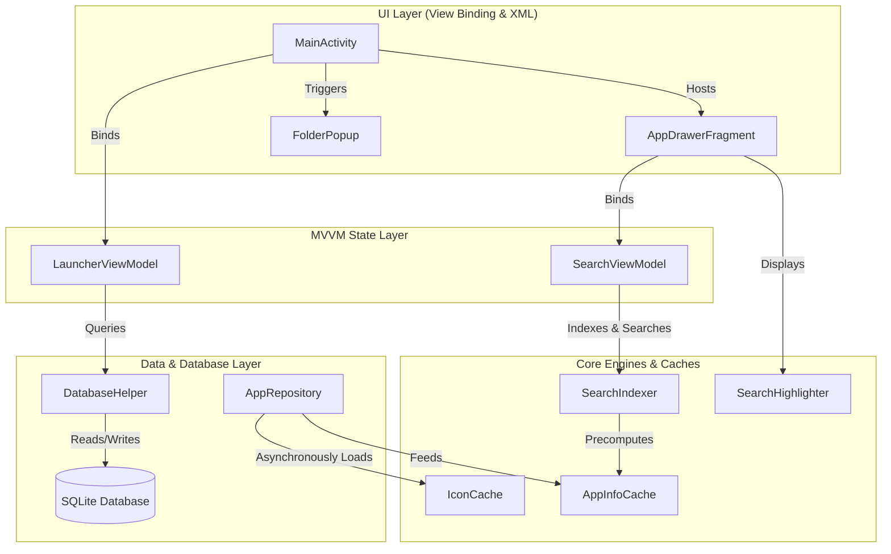

# Kux Launcher 🚀

Kux Launcher is a modern, high-performance, and feature-rich Android launcher engineered using clean architecture, Kotlin, XML ViewBinding, and MVVM principles. It is inspired by industry-leading launchers like **Pixel Launcher**, **Nova Launcher**, and **Niagara**, delivering butter-smooth 60 FPS transitions and a premium, dark glassmorphic user experience.

---

## 📖 Project Overview
Kux Launcher transforms the basic Android home screen experience into a polished, recruiter-grade modern desktop ecosystem. By bridging a custom-developed, high-speed cellular grid system with physics-based gesture engines and real-time background search indexers, Kux Launcher demonstrates high-fidelity Android software engineering. It is built strictly with ViewBinding and traditional XML layouts (no Compose) to maximize performance and compatibility.

---

## 🎨 System Architecture

This architectural diagram outlines the separation of concerns, data pipelines, and interactive layer bonds inside Kux Launcher:



---

## ✨ Features

- **Persistent Desktop Grid & Dock**: Standard $5 \times 5$ cellular desktop grids and $5 \times 1$ persistent bottom Dock grids supporting shortcut dragging and repositioning.
- **Glassmorphic Folders**: Merge desktop shortcuts dynamically into rounded folder containers, supporting rename, add, drag-out, and popups.
- **Full-Screen App Drawer**: Seamless gesture-activated drawer with a 4-column application list and premium dark frosted-glass visual themes (#E6161616 90% opacity).
- **Real-Time Asynchronous Search**: CPU-bound search filtering executed entirely on `Dispatchers.Default` background threads.
- **Highlight Substring Painting**: Highlights letters inside app labels matching the search query using bold accent typography in real-time.
- **A-Z Fast Sidebar Scroll**: A vertical letter strip (`A-Z` and `#`) on the right side of the drawer that scrolls the app list instantly to matching entries when tapped or swiped.
- **Elastic Spring Physics**: Natural elastic drawer slides using the native Android `DynamicAnimation` spring system (medium stiffness, zero bounce).
- **Depth Layer Scale Transitions**: Scales the desktop workspace layout down slightly (from `1.0` to `0.95`) and fades it as the drawer slides up, creating an organic 3D depth effect.
- **Dynamic Caching Pipelines**: Size-restricted thread-safe `LruCache` for application icons and single-instance memory registry `AppInfoCache` to bypass costly Package Manager queries.

---

## 🛠️ Tech Stack

- **Core Language**: Kotlin
- **UI Framework**: XML Layouts & ViewBinding (No Jetpack Compose to maintain lightweight, high-performance bounds)
- **Architecture**: MVVM (Model-View-ViewModel) + Structured Clean Architecture
- **State Management**: LiveData & Lifecycle-aware components
- **Concurrency**: Kotlin Coroutines (offloading tasks to `Dispatchers.IO` and `Dispatchers.Default`)
- **Animation Physics**: Android Dynamic Animation (Spring Force & Velocity Tracking)
- **Database**: SQLite (native local persistence)

---

## 🖼️ Screenshots Section (Placeholders)

> [!NOTE]
> Below are structural placeholders for the launcher's visual assets:

| Home Screen Workspace | Full-Screen Search Drawer | Folder Container Popup |
| :---: | :---: | :---: |
|  |  |  |

---

## 📂 Project Structure

```
com.kuxlauncher
│
├── drawer                      # App Drawer controllers, states & overlays
│   ├── AppDrawerFragment.kt    # Main drawer layout coordinator fragment
│   ├── DrawerStateManager.kt   # State machine (CLOSED, DRAGGING, ANIMATING, OPENED)
│   ├── DrawerGestureController.kt # Touch finger-tracking drag gesture parser
│   ├── DrawerAnimationHelper.kt # Coordinates physics-based open/close slides
│   └── DrawerSearchManager.kt  # Connects EditText changes with debounced search
│
├── search                      # Real-time search query matching components
│   ├── SearchViewModel.kt      # Asynchronously delegates query filters on background contexts
│   ├── SearchIndexer.kt        # Precomputes normalized indices for instant filtering
│   ├── SearchAdapter.kt        # RecyclerView adapter utilizing text highlights
│   └── SearchHighlighter.kt    # Spans bold, accent color styling over matched substrings
│
├── cache                       # Fast caching components
│   ├── IconCache.kt            # Thread-safe LruCache for in-memory app icons
│   └── AppInfoCache.kt         # Stores list arrays returned by PackageManager
│
├── gesture                     # Home screen gestures & trackers
│   ├── SwipeGestureDetector.kt  # Detects vertical flick gestures on desktop empty space
│   ├── VelocityTrackerHelper.kt # Tracks scroll speed and flick velocities
│   └── WorkspaceDragListener.kt # Intercepts shortcut moves, folder merges & removals
│
├── animation                   # Spring physics & visual depth effects
│   ├── SpringAnimationHelper.kt # Handles android.dynamicanimation spring structures
│   └── DrawerTransitionHelper.kt# Updates scales, translations, and alphas dynamically
│
├── utils                       # Universal helpers
│   ├── BlurHelper.kt           # Generates dark premium glassmorphism shapes
│   ├── DebounceHelper.kt       # Coroutine debounce processor
│   └── KeyboardUtils.kt        # Robust soft input focus coordinator
│
├── view                        # UI Activities
│   └── MainActivity.kt         # Main container orchestrating desktops, folders & drawer
│
└── viewmodel                   # MVVM models
    └── LauncherViewModel.kt    # Drives persistent shortcuts, dock & folder databases
```

---

## ⚙️ Setup & Build Instructions

### System Requirements
- **JDK**: Java Development Kit 17 or higher
- **Android SDK**: API level 24 (Android 7.0 Nougat) or higher
- **Gradle**: Built using wrapper bundle 9.1.0

### Cloning and Opening
1. Clone the project locally:
   ```bash
   git clone https://github.com/AVPXM8/android-launcher.git
   ```
2. Open Android Studio and select `File -> Open`, targeting the root `Launcher` directory.

### Build Instructions
Execute local gradle targets via command terminal:
- Build Debug APK:
  ```bash
  ./gradlew assembleDebug
  ```
- Compile Kotlin source checks:
  ```bash
  ./gradlew compileDebugKotlin
  ```

---

## 📱 Emulator & Device Setup

1. Open Android Studio's **Device Manager** and create a Virtual Device (AVD).
2. Choose **API Level 34 (Android 14)** or higher for complete performance feature compatibility.
3. Deploy Kux Launcher:
   - Connect your real Android device (ensure Developer Options and USB Debugging are active) or boot up the virtual emulator.
   - Run the `:app` configuration using the Green Play Button in Android Studio.

---

## 🛡️ Launcher Permissions

Kux Launcher requires the following configurations to act as a system-integrated workspace:
- **Default Home App**: Upon deployment, press the system Home button. Select **Kux Launcher** and tap **"Always"** to register it as the default persistent desktop shell.
- **Package Visibility (`<queries>`)**: Declared inside `AndroidManifest.xml` to allow queries of other launchable activities in Android 11+ (API 30+).

---

## 💫 Core Engine Walkthroughs

### 1. Gesture System
Uses `VelocityTrackerHelper` and `SwipeGestureDetector` to track finger speed and direction. When released, if velocity exceeds $\pm 800$ pixels/second, it triggers elastic open or close spring animations. A custom `DrawerTransitionHelper` updates progress ticks, altering alpha bounds and workspace scaling proportionally.

### 2. Search System
Inputs inside the search text field are captured by `DrawerSearchManager` and passed through `DebounceHelper` to introduce a $150\text{ms}$ delay. Queries are processed by `SearchViewModel` inside `Dispatchers.Default`, running case-insensitive scans against `SearchIndexer` values. Result strings are compiled inside `SearchHighlighter` to paint matching matches using the accent theme palette.

### 3. Folder System
Two home screen items dropped onto the same coordinates trigger `mergeShortcutsToFolder` inside `LauncherViewModel`. A custom `FolderPopup` overlay lists folder children and allows renaming. If a child is dragged out of the popup boundaries, it instantly returns to the workspace grid.

### 4. Database Persistence
Backed by a SQLite database wrapper (`DatabaseHelper`). Read and write queries are dispatched asynchronously via `Dispatchers.IO`. Tables manage coordinate positions (`cellX`, `cellY`), container states (`CONTAINER_DESKTOP`, `CONTAINER_DOCK`, or folder parent IDs), and item labels.

---

## 🚀 Performance Optimizations
- **Structured Coroutines**: Raw scopes inside shortcut rendering are replaced with lifecycle-scoped coroutines (`lifecycleScope.launch`), entirely mitigating activity memory leak profiles.
- **Stable IDs**: `AppAdapter` and `SearchAdapter` leverage stable, precomputed item hashes, enabling the RecyclerView to recycle and reuse elements cleanly during scrolls.
- **Lazy Eviction Caches**: A size-constrained `IconCache` uses pixel byte calculations to evict icons, preserving total runtime memory.

---

## 🧪 Testing Instructions

Run the local JVM test suite to assert indexing, search matching, and caching features:
```bash
./gradlew testDebugUnitTest
```

### Verification Scenarios Tested
1. **`testAppInfoCache_getSetClear`**: Assures that local registries write, cache, and evict app lists without leakage.
2. **`testSearchIndexer_matching`**: Verifies case-insensitive app query matches, package name filtering, and empty query fallbacks.
3. **`testSearchHighlighter_emptyQuery`**: Asserts that blank queries bypass framework `SpannableString` creation, enabling JVM compilation.

---

## ⚠️ Known Limitations
- Real-time blurring effects depend on solid translucent layers for backward compatibility down to Android 7 (API 24).
- Widget addition support is prepared via future architectural hooks.

---

## 🤝 Contributing
1. Fork the Project.
2. Create your Feature Branch (`git checkout -b feature/AmazingFeature`).
3. Commit your Changes (`git commit -m 'feat: Add some AmazingFeature'`).
4. Push to the Branch (`git push origin feature/AmazingFeature`).
5. Open a Pull Request.

---

## 📄 License
This project is licensed under the MIT License - see the [LICENSE](LICENSE) file for details.
